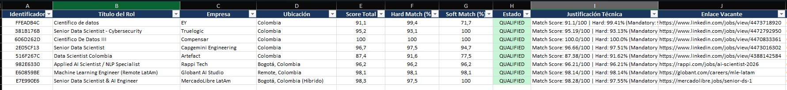

# 🎯 Job-Copilot (v1.0.0)

> **Sistema Autónomo de Prospección Inteligente de Empleo, Matching Semántico RAG Local y Compilación de CVs Adaptados para ATS.**

[](https://www.python.org/)
[](LICENSE)
[](#arquitectura-del-sistema)
[](#suite-de-pruebas)

---

## 📌 Tabla de Contenido
1. [Visión General](#visión-general)
2. [Arquitectura del Sistema](#arquitectura-del-sistema)
3. [Módulos del Pipeline](#módulos-del-pipeline)
4. [Inicio Rápido en 5 Pasos](#inicio-rápido-en-5-pasos)
5. [Uso del CLI y Ejemplos Prácticos](#uso-del-cli-y-ejemplos-prácticos)
6. [Referencia de Configuración (.env)](#referencia-de-configuración-env)
7. [Base de Datos y Estados de Vacantes](#base-de-datos-y-estados-de-vacantes)
8. [Suite de Pruebas Unitarias](#suite-de-pruebas-unitarias)
9. [Responsabilidad Ética y Scraping](#responsabilidad-ética-y-scraping)

---

## 🌟 Visión General

**Job-Copilot** resuelve la asimetría de tiempo y fricción algorítmica en la búsqueda de empleo para profesionales técnicos (Data Science, Machine Learning, Analytics Engineering, MLOps e Inteligencia Artificial). 

En lugar de postulaciones masivas genéricas que son descartadas por sistemas **ATS (Applicant Tracking Systems)** como Workday, Lever o Greenhouse:
* Extrae vacantes en tiempo real desde múltiples portales (**LinkedIn, Indeed, Glassdoor, ZipRecruiter, Google Jobs**).
* Deduplica registros mediante un **hashing criptográfico SHA-256** determinista.
* Extrae la anatomía de los requisitos con **Google Gemini REST API** y esquemas Pydantic rigurosos.
* Evalúa la afinidad candidato-vacante con un motor de **RAG Local Vectorial (SentenceTransformers)** y álgebra de similitud coseno calibrada (sin costo de tokens para el matching).
* Compila automáticamente **CVs de alta fidelidad ATS en Word (.docx) y PDF**, reordenando viñetas de experiencia según la afinidad semántica con la oferta.
* Exporta informes ejecutivos a **Microsoft Excel** con formato corporativo e hipervínculos funcionales.

---

## 🏗️ Arquitectura del Sistema

```text
 ┌────────────────────────────────────────────────────────────────────────┐
 │                      1. INGESTA Y PROSPECCIÓN                         │
 │     LinkedIn | Indeed | Glassdoor | ZipRecruiter | Google Jobs         │
 └───────────────────────────────────┬────────────────────────────────────┘
                                     │ (JobSpy multicanal)
                                     ▼
 ┌────────────────────────────────────────────────────────────────────────┐
 │                   2. DEDUPLICACIÓN SHA-256 Y SQLITE                    │
 │               data/jobs.db (idempotencia en job_hash)                  │
 └───────────────────────────────────┬────────────────────────────────────┘
                                     │ Vacantes PENDING / SCRAPED
                                     ▼
 ┌────────────────────────────────────────────────────────────────────────┐
 │                 3. EXTRACCIÓN TAXONÓMICA ESTRUCTURADA                 │
 │       Google Gemini REST API (Pydantic JobRequirementsSchema)         │
 │     • Mandatory Hard Skills   • Nice to Have   • Soft Skills Context   │
 │     • Años de experiencia     • Gatekeeper territorial (Remoto/LatAm)  │
 └───────────────────────────────────┬────────────────────────────────────┘
                                     │
                                     ▼
 ┌────────────────────────────────────────────────────────────────────────┐
 │                  4. MOTOR DE MATCHING RAG LOCAL                        │
 │         SentenceTransformers: paraphrase-multilingual-MiniLM-L12-v2    │
 │     • Catálogo léxico en memoria de data/master_cv.json                │
 │     • Boosters dimensionales: Educación (2.0x), Idiomas (1.5x),        │
 │       Industria (1.5x), Hard Skills (1.0x), Certificaciones (1.0x)     │
 │     • Calibración no lineal del coseno & Gatekeeper técnico (< 30%)    │
 │     • Penalización por brecha de seniority (0.50x floor)               │
 └───────────────────┬────────────────────────────────┬───────────────────┘
                     │ Score < Umbral                 │ Score >= Umbral
                     ▼                                ▼
              [ DISQUALIFIED ]                   [ QUALIFIED ]
                                                      │
                                                      ▼
 ┌────────────────────────────────────────────────────────────────────────┐
 │                 5. COMPILACIÓN DE CV ATS BILINGÜE                     │
 │     • Generación DOCX nativo unicolumna adaptado al perfil (CO / VE)   │
 │     • Selector Top K viñetas por afinidad semántica con la vacante     │
 │     • Conversión automática a PDF vectorial de alta precisión          │
 └───────────────────────────────────┬────────────────────────────────────┘
                                     │
                                     ▼
 ┌────────────────────────────────────────────────────────────────────────┐
 │                 6. REPORTERÍA EJECUTIVA EN EXCEL                       │
 │      output/prospectos_calificados.xlsx (openpyxl formateado)          │
 └────────────────────────────────────────────────────────────────────────┘
```

---

## 📦 Módulos del Pipeline

| Archivo | Responsabilidad Principal |
| :--- | :--- |
| `src/config.py` | Configuración centralizada (**Zero-Hardcode**): rutas, credenciales, umbrales y pesos leídos de `.env`. |
| `src/scraper.py` | Extracción multicanal con JobSpy, filtrado de portales geográficos y validación de descripciones. |
| `src/database.py` | Gestión de SQLite (`data/jobs.db`), deduplicación por SHA-256 y persistencia de estados. |
| `src/extractor.py` | Extracción taxonómica con Gemini REST API estructurada en `JobRequirementsSchema`. |
| `src/embeddings.py` | Vectorización semántica local, indexador en memoria de `master_cv.json` y calibración de coseno. |
| `src/matcher.py` | Evaluación híbrida: scoring 70% Hard + 30% Soft, gatekeepers técnicos y selector Top K de viñetas. |
| `src/compiler.py` | Ensamblaje de currículums ATS en formatos DOCX y PDF según país e idioma de la oferta. |
| `src/exporter.py` | Generación de reporte consolidado en Microsoft Excel con estilos corporativos y autofiltros. |
| `main.py` | Orquestador principal CLI con interfaz dinámica basada en `argparse`. |

---

## 🚀 Inicio Rápido en 5 Pasos

### 1. Clonar el repositorio
```bash
git clone https://github.com/jairochoa/job-copilot.git
cd job-copilot
```

### 2. Crear y activar el entorno virtual
* **Windows (PowerShell):**
  ```powershell
  python -m venv .venv
  .\.venv\Scripts\Activate.ps1
  ```
* **Linux / macOS:**
  ```bash
  python3 -m venv .venv
  source .venv/bin/activate
  ```

### 3. Instalar dependencias
```bash
pip install --upgrade pip
pip install -r requirements.txt
```

### 4. Configurar variables de entorno
Copia la plantilla y edita tu archivo `.env` en tu máquina local:
```powershell
Copy-Item .env.example .env
```
Agrega tu clave de API de **Google AI Studio** en `.env`:
```env
GEMINI_API_KEY="AIzaSyTuClaveReal..."
```

### 5. Configurar tu CV Maestro
Edita el archivo `data/master_cv.json` con tu experiencia, proyectos, habilidades técnicas, certificaciones y formación académica.

---

## 💻 Interfaz de Línea de Comandos (CLI) y Guía de Uso

El archivo `main.py` actúa como el **orquestador central** del proyecto. Permite controlar todo el flujo de trabajo (prospección, análisis taxonómico con IA, matching semántico RAG, compilación de CVs ATS y exportación a Excel) de forma flexible mediante banderas (*flags*) desde la terminal, sin necesidad de modificar ningún archivo de código Python.

### 📋 Referencia de Banderas y Opciones del CLI

| Bandera | Tipo | Valor por Defecto | Descripción |
| :--- | :---: | :---: | :--- |
| `--terms` | `str` | Valor de `.env` | Términos o cargos de búsqueda separados por comas (ej. `"Data Scientist, Machine Learning Engineer"`). |
| `--locations` | `str` | Valor de `.env` | Ubicaciones geográficas separadas por comas (ej. `"Colombia, España, Remote"`). |
| `--results` | `int` | `5` | Número máximo de vacantes a raspar por cada combinación de término y ubicación. |
| `--hours` | `int` | `72` | Antigüedad máxima de publicación de las vacantes en horas (ej. `24` para ofertas del último día). |
| `--remote` | `flag` | `false` | Filtra estrictamente vacantes con modalidad 100% remota. |
| `--skip-scraping` | `flag` | `false` | Omite la prospección web y procesa directamente las vacantes en cola dentro de `data/jobs.db`. |
| `--only-qualified` | `flag` | `false` | Genera el informe final de Excel incluyendo exclusivamente las vacantes con estatus `QUALIFIED`. |
| `--help`, `-h` | `flag` | - | Despliega la ayuda interactiva y la lista completa de parámetros en consola. |

---

### 🛠️ Casos de Uso y Flujos de Trabajo Recomendados

#### Caso 1: Ejecución Diaria Automática
Ejecuta el pipeline completo utilizando la configuración por defecto de tu archivo `.env`:
```powershell
python main.py
```
> **¿Qué hace?** Busca ofertas según tus términos y países configurados, extrae los requisitos con Gemini, calcula el match score con RAG local, genera los CVs en `.docx` y `.pdf` para las vacantes que califiquen, y actualiza el reporte en Excel.

---

#### Caso 2: Prospección Multirregional Personalizada (Colombia, Venezuela, España, etc.)
Si deseas buscar simultáneamente en diferentes países o mercados para roles específicos:
```powershell
python main.py --terms "Senior Data Scientist, Machine Learning Engineer" --locations "Colombia, Venezuela, España, Remote" --results 3
```

---

#### Caso 3: Búsqueda Urgente de Ofertas 100% Remotas del Último Día
Cuando deseas revisar únicamente las vacantes publicadas en las últimas 24 horas con trabajo remoto global:
```powershell
python main.py --terms "Applied AI Scientist, Analytics Engineer" --locations "Remote" --hours 24 --remote --results 10
```

---

#### Caso 4: Modo Offline / Re-evaluación (`--skip-scraping`)
Úsalo si:
* Ya extrajiste vacantes previamente y solo deseas evaluarlas sin volver a consultar LinkedIn o Indeed.
* Editaste tu [data/master_cv.json](file:///c:/Projects/job-copilot/data/master_cv.json) (agregaste una nueva certificación o experiencia) y deseas re-evaluar la cola existente.
* Cambiaste el umbral `MIN_QUALIFIED_SCORE` en `.env` y quieres regenerar los currículums.
```powershell
python main.py --skip-scraping
```

---

#### Caso 5: Generación de Reporte Ejecutivo Filtrado (`--only-qualified`)
Exporta el informe `output/prospectos_calificados.xlsx` conteniendo **únicamente** las ofertas que superaron el umbral de calificación (`QUALIFIED`), excluyendo las descalificadas:
```powershell
python main.py --skip-scraping --only-qualified
```

---

#### Caso 6: Consultar la Ayuda del CLI
El nombre de los parámetros se pueden consultar en el manual integrado:
```powershell
python main.py --help
```


## Salidas y reportes generados

Al finalizar la ejecución, el sistema genera dos tipos de artefactos en la carpeta `output/`:

1. **Currículums adaptados para ATS**: Documentos en formatos Word (`.docx`) y `.pdf` estructurados a una columna y personalizados según los requisitos de cada vacante calificada.
2. **Reporte consolidado en Excel**: Un libro de cálculo (`output/prospectos_calificados.xlsx`) con el análisis de cada oferta, puntajes desglosados, hipervínculos funcionales y enlaces locales a los CVs generados.

### Vista previa del reporte en Excel

<p align="center">
  
</p>


## ⚙️ Referencia de Configuración (.env)

### 🌍 Diferencia Clave: `SCRAPER_LOCATIONS` vs `CANDIDATE_PRIMARY_LOCATION`

Es común confundir estas dos variables geográficas, pero cumplen funciones totalmente distintas en el pipeline:

* **`SCRAPER_LOCATIONS` (¿Dónde busca el scraper?):**  
  Define en qué portales y regiones geográficas de LinkedIn/Indeed se buscarán ofertas de empleo.  
  *Ejemplo:* `SCRAPER_LOCATIONS="Colombia, Venezuela, España, Remote"`
* **`CANDIDATE_PRIMARY_LOCATION` (¿Dónde eres elegible tú?):**  
  Instruye al analizador de requisitos de Google Gemini sobre la disponibilidad geográfica real. Actúa como **Gatekeeper Territorial**: si una oferta exige residencia física obligatoria en Alemania o ciudadanía estricta de EE.UU. (ej. *US Security Clearance*), Gemini la descalificará (`is_remote_or_eligible = False`). Si la oferta admite trabajo remoto o residencia en tus regiones, la admitirá para evaluación.  
  *Ejemplo:* `CANDIDATE_PRIMARY_LOCATION="Colombia, Venezuela, España y Remoto Internacional"`

> 🇪🇺 **Soporte para España y Europa:** El scraper ([src/scraper.py](file:///c:/Projects/job-copilot/src/scraper.py)) detecta automáticamente si la ubicación pertenece a Europa o Norteamérica, habilitando portales como Glassdoor que normalmente bloquean consultas regionales directas desde Latinoamérica.

---

### Tabla Completa de Variables de Entorno

Todas las variables son completamente opcionales y cuentan con valores por defecto óptimos en `src/config.py`:

| Variable | Tipo | Default | Descripción |
| :--- | :---: | :---: | :--- |
| `GEMINI_API_KEY` | `str` | `""` | Llave de API de Google AI Studio (requerida para extracción). |
| `GEMINI_MODEL` | `str` | `gemini-3.5-flash-lite` | Modelo de Gemini para extracción taxonómica. |
| `SCRAPER_SEARCH_TERMS` | `list` | `Data Scientist, Machine Learning...` | Términos de búsqueda por defecto. |
| `SCRAPER_LOCATIONS` | `list` | `Colombia, Remote` | Ubicaciones geográficas de búsqueda. |
| `SCRAPER_RESULTS_WANTED` | `int` | `5` | Ofertas por combinación término/ubicación. |
| `SCRAPER_HOURS_OLD` | `int` | `72` | Antigüedad máxima de publicación en horas. |
| `SCRAPER_IS_REMOTE` | `bool` | `false` | Forzar búsqueda únicamente remota. |
| `EMBEDDING_MODEL_NAME` | `str` | `paraphrase-multilingual-MiniLM-L12-v2` | Modelo SentenceTransformers local. |
| `MIN_QUALIFIED_SCORE` | `float` | `60.0` | Umbral para clasificar como `QUALIFIED`. |
| `HARD_SKILLS_WEIGHT` | `float` | `0.70` | Peso de habilidades duras (70%). |
| `SOFT_SKILLS_WEIGHT` | `float` | `0.30` | Peso de habilidades blandas (30%). |
| `MIN_MANDATORY_HARD_THRESHOLD` | `float` | `30.0` | Gatekeeper: mínimo de hard skills para aprobar. |
| `SENIORITY_FLOOR_MULTIPLIER` | `float` | `0.50` | Piso de penalización por brecha de seniority. |
| `WEIGHT_EDUCATION` | `float` | `2.0` | Ponderación del booster de educación. |
| `WEIGHT_LANGUAGES` | `float` | `1.5` | Ponderación del booster de idiomas. |
| `WEIGHT_INDUSTRY` | `float` | `1.5` | Ponderación del booster de sector/industria. |
| `MAX_BULLETS_PER_COMPANY` | `int` | `3` | Límite de viñetas priorizadas por empresa en CV. |
| `CANDIDATE_PRIMARY_LOCATION` | `str` | `Colombia / LatAm` | Región elegible para el filtro territorial. |

---

## 🗄️ Base de Datos y Estados de Vacantes

La tabla `job_applications` en `data/jobs.db` registra el ciclo de vida de cada postulación:

```
[ PENDING / SCRAPED ] 
         │
         ▼ (Evaluación RAG + Gemini)
 ┌───────┴───────┐
 ▼               ▼
[ QUALIFIED ]   [ DISQUALIFIED ]
 │
 ├──> Compilación de CV (.docx y .pdf)
 └──> Exportación a Excel (output/prospectos_calificados.xlsx)
```

* **`PENDING` / `SCRAPED`**: Vacante recién capturada por el scraper.
* **`QUALIFIED`**: Vacante con `match_score >= MIN_QUALIFIED_SCORE` que cumple los gatekeepers territoriales y técnicos.
* **`DISQUALIFIED`**: Vacante rechazada por incompatibilidad geográfica, brecha de skills duras (< 30%) o afinidad insuficiente.

---

## 🧪 Suite de Pruebas Unitarias

El repositorio cuenta con una cobertura integral de pruebas unitarias implementadas con `pytest`:

```powershell
pytest -v
```

### Cobertura de Pruebas:
* **Persistencia y Deduplicación (`test_database.py`, `test_deduplication.py`):** Determinismo de hashing SHA-256 e idempotencia ante inserciones repetidas.
* **Motor Vectorial (`test_embeddings.py`):** Invariancia semántica multilingüe (ES vs EN), ortogonalidad, propiedades del coseno y escalado 0-100.
* **Matching RAG (`test_matcher.py`):** Gatekeeper territorial, descalificación de vacantes sin skills, boosters multidimensionales y descalificación categórica de vacantes ajenas (Abogados, Chefs).
* **Compilador ATS (`test_compiler.py`):** Reglas de sanitización, selección de perfil por país e inyección de viñetas.
* **Extracción y Scraper (`test_extractor.py`, `test_scraper.py`):** Detección de idioma, clasificación de ATS y filtrado regional de portales.

---

## ⚖️ Responsabilidad Ética y Scraping

Este software ha sido diseñado con fines de investigación, productividad profesional y postulación personal ética. Al utilizar este proyecto:
* Respeta los términos de servicio y políticas de uso aceptable de cada plataforma de empleo.
* Configura pausas razonables y límites moderados de resultados (`SCRAPER_RESULTS_WANTED`) para evitar sobrecargar los servidores destino.
* Job-Copilot no comercializa datos ni realiza envíos masivos indiscriminados sin supervisión.